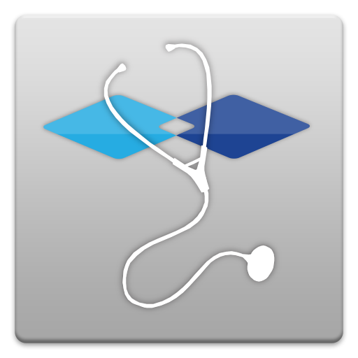

# HelloID-Conn-Prov-Target-Ysis

| :warning: Warning |
|:---------------------------|
| Note that this is connector is **not ready** to use in your production environment.       |

| :information_source: Information |
|:---------------------------|
| This repository contains the connector and configuration code only. The implementer is responsible to acquire the connection details such as username, password, certificate, etc. You might even need to sign a contract or agreement with the supplier before implementing this connector. Please contact the client's application manager to coordinate the connector requirements.       |

 

  

## Table of contents

- [Introduction](#Introduction)
- [Getting started](#Getting-started)
  + [Connection settings](#Connection-settings)
  + [Prerequisites](#Prerequisites)
  + [Remarks](#Remarks)
- [Setup the connector](Setup-The-Connector)
- [Getting help](Getting-help)

## Introduction
The HelloID-Conn-Prov-Target-Ysis connector create and update user accounts in Ysis. The Ysis API is a SCIM based (http://www.simplecloud.info) API and has some limitations for our provisioning process. This means that not all scenarios can be automated in HelloID. In Ysis an account has a discipline that acts as a sort of an account Type.
When a person requires a different or extra discipline. There must be created a new user account with the new discipline. In Ysis it is not possible to change the discipline of an existing account. This change must be processed manually. The connector triggers a mail to the Ysis administrator and treats the update action as a success when the email is sent.

## Getting started

### Prerequisites
 - The "IAM-ID" field of Ysis must be filled with employeeNumber before implementing this connector.
 - The URLs and the OAuth Credentials. Which are documented in the connection settings.
 - A Mail server which accessible by HelloId or the Agent.
 - Mapping Between function and discipline
 - Possible Mapping between function and profession, which needed to be one of COD878-DBCO, see https://www.vektis.nl/standaardisatie/codelijsten/COD878-DBCO

### Actions
| Kind     | Description |
| ------------ | ----------- |
| Create     | Create a new account or correlate an existing, based on an IAM-ID that represents the EmployeeId.  |
| Delete   | Update the account to a inactive state   |
| Update    |  Performs __NO__ account updates. It will only triggers a mail after the displine is changed |

### Connection settings
The following settings are required to connect to the API.

| Setting     | Description |
| ------------ | ----------- |
| ClientID     | The ClientId to connect to the Ysis API   |
| ClientSecret   | The ClientSecret to connect to the Ysis API  |
| BaseUrl    |    The URL to the Ysis environment. Example: https://tools4ever.acceptatie1.ysis.nl/um/api|
| AuthenticationUrl | The URI to retrieve the oAuth token. Example: https://tools4ever.acceptatie1.ysis.nl/cas/oauth/token |
| To | The 'To' Email Address of the Administrator. Who needs to be informed when a discipline update takes place. |
| SmtpServerAddress | The URL of the Exchange Server |

### Remarks
 - It's not possible not to get an existing account.
 - All the update actions are a "PUT" webrequest. This means in this case that always the whole account object must be sent.
 - The correlation is done on the IAM-ID (id) (EmployeeNumber)
 - It is not possible to get the current discipline of an existing account in Ysis. And with updating the account the discipline property is ignored. There is no verification possible to verify the existing account in Ysis and the discipline from HelloID.
 - When HelloID has created the Ysis account. We save the discipline in the account reference. That makes it possible to check in the update action if the "discipline" is changed. When the discipline is changed, we send a mail to the Ysis administrator. To update/create the new account with a different "discipline". This is a manual action. Due to a limitation of the Ysis Webservice.

## Getting help

> _For more information on how to configure a HelloID PowerShell connector, please refer to our [documentation](https://docs.helloid.com/hc/en-us/articles/360012557600-Configure-a-custom-PowerShell-source-system) pages_

> _If you need help, feel free to ask questions on our [forum](https://forum.helloid.com)_

## HelloID Docs

The official HelloID documentation can be found at: https://docs.helloid.com/

